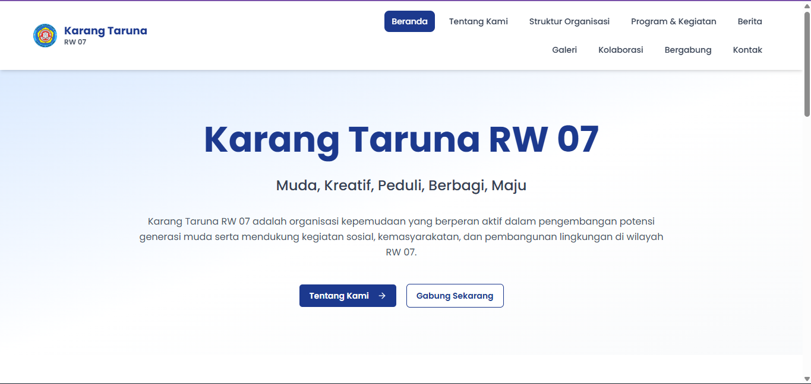
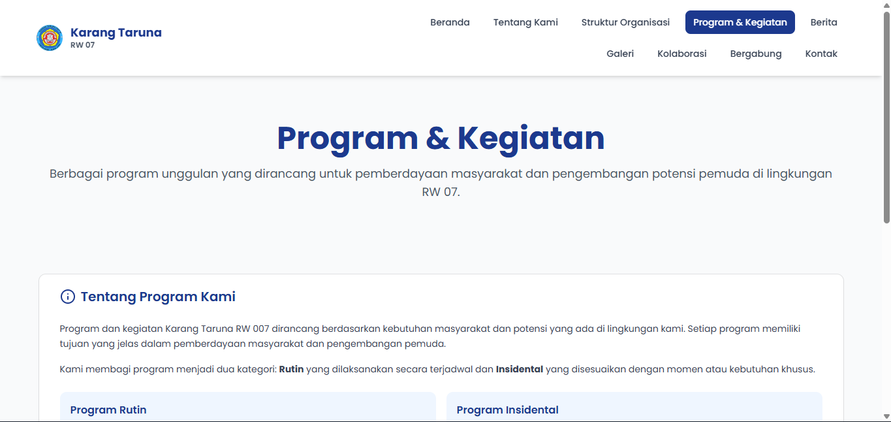
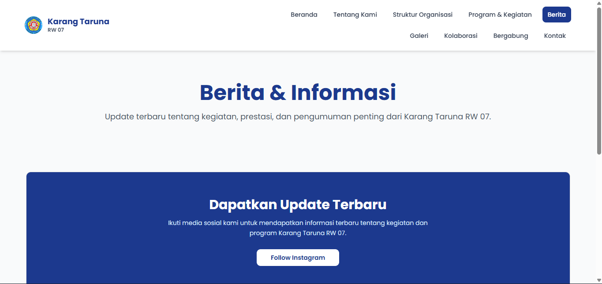
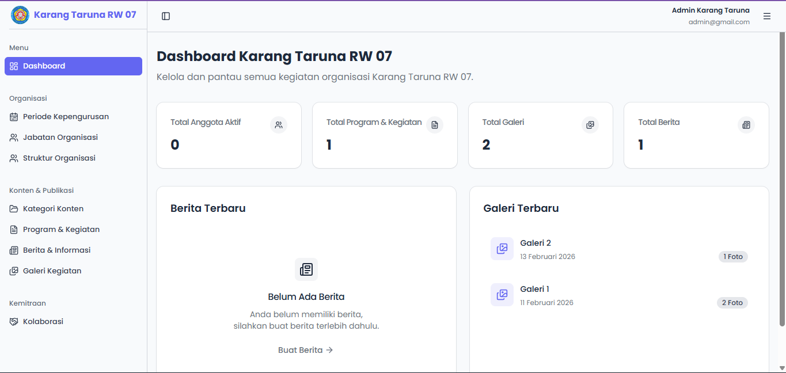
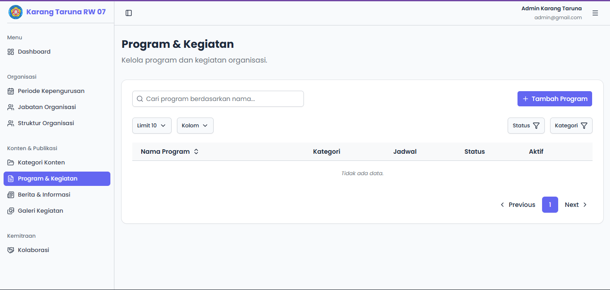
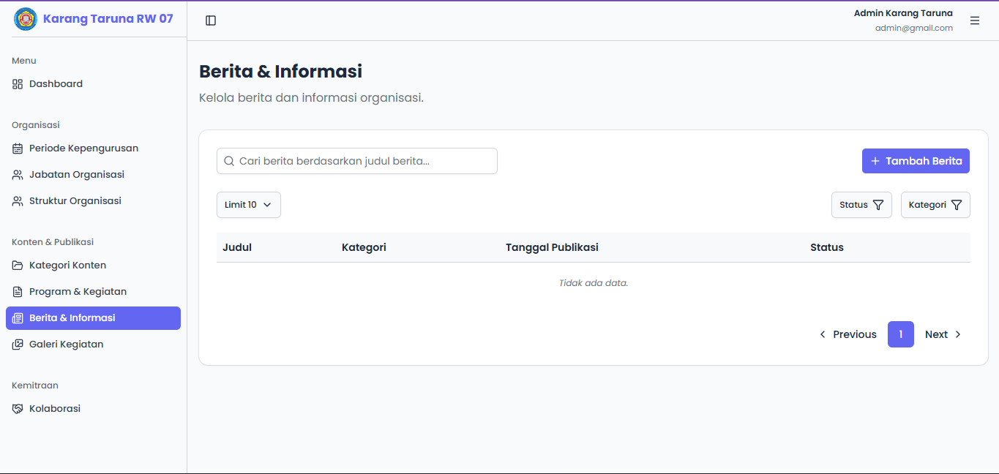
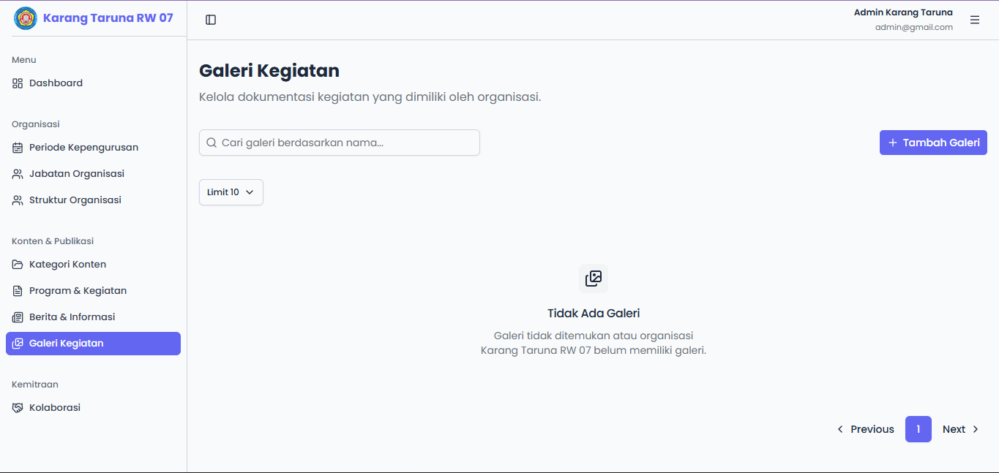
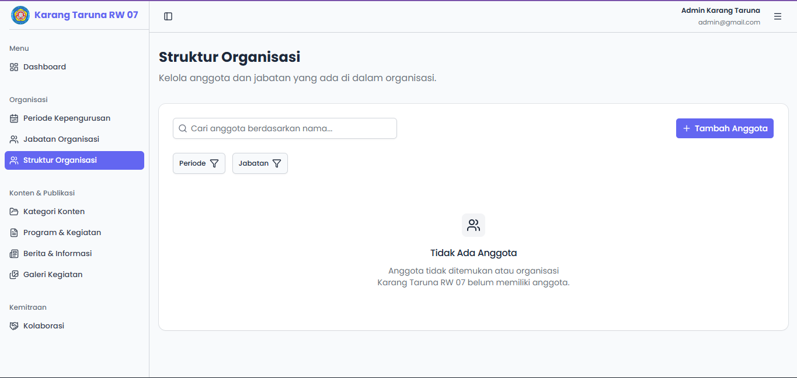

<div align="center">

# 🏘️ Karang Taruna RW 07

### Company Profile & Dashboard Management System

[](https://www.typescriptlang.org/)
[](https://reactjs.org/)
[](https://tanstack.com/)
[](https://tailwindcss.com/)
[](https://supabase.com/)
[](https://bun.sh/)
[](https://www.netlify.com/)

[Demo](#-demo) • [Fitur](#-fitur) • [Instalasi](#-instalasi) • [Penggunaan](#-penggunaan) • [Screenshots](#-screenshots)

</div>

---

## 📋 Deskripsi

**Karang Taruna RW 07** adalah aplikasi web modern yang terdiri dari **Company Profile** dan **Dashboard Management System** yang dikembangkan untuk organisasi Karang Taruna RW 07. Aplikasi ini dibangun dengan fokus pada performa, type-safety, dan user experience yang optimal.

Proyek ini dibangun menggunakan arsitektur **monorepo** dengan [Better-T-Stack](https://github.com/AmanVarshney01/create-better-t-stack) sebagai foundation, menggabungkan React, TypeScript, TanStack ecosystem, dan Supabase sebagai backend.

---

## 🌐 Demo

- **🌍 Company Profile**: [karang-taruna-rw07.com](https://karang-taruna-rw07.com)
- **📊 Dashboard**: [dashboard.karang-taruna-rw07.com](https://dashboard.karang-taruna-rw07.com)

---

## ✨ Fitur

- **TypeScript** - Untuk keamanan tipe dan pengalaman pengembang yang lebih baik
- **TanStack Router** - Perutean berbasis file dengan keamanan tipe penuh
- **TailwindCSS** - CSS berbasis utilitas untuk pengembangan UI yang cepat
- **shadcn/ui** - Komponen UI yang dapat digunakan kembali
- **Biome** - Linting dan pemformatan
- **Husky** - Git hooks untuk kualitas kode
- **Turborepo** - Sistem build monorepo yang dioptimalkan
- **Supabase** - Backend as a Service (BaaS)

### 🌐 Company Profile Web
- **Beranda** - Halaman utama dengan informasi overview
- **Tentang Kami** - Profil dan visi misi organisasi
- **Struktur Organisasi** - Hierarki kepengurusan
- **Program & Kegiatan** - Daftar program dan kegiatan organisasi
- **Berita** - Informasi terkini dan artikel
- **Galeri** - Dokumentasi foto kegiatan
- **Kolaborasi** - Informasi kemitraan dan kolaborasi
- **Bergabung** - Formulir pendaftaran anggota baru
- **Kontak** - Informasi kontak dan lokasi

### 📊 Dashboard Management
- **Dashboard (Index)** - Overview dan statistik
- **Periode Kepengurusan** - Manajemen periode organisasi
- **Jabatan Organisasi** - Pengaturan posisi dan jabatan
- **Struktur Organisasi** - Manajemen hierarki kepengurusan
- **Kategori Konten** - Kategorisasi konten website
- **Program & Kegiatan** - CRUD program dan kegiatan
- **Berita & Informasi** - Manajemen artikel dan berita
- **Galeri Kegiatan** - Upload dan manajemen foto
- **Kolaborasi** - Manajemen data kemitraan

---

## 🛠️ Teknologi yang Digunakan

### Frontend
- **[React](https://reactjs.org/)** - Library JavaScript untuk membangun user interface
- **[TypeScript](https://www.typescriptlang.org/)** - JavaScript dengan type safety
- **[Vite](https://vitejs.dev/)** - Next generation frontend tooling
- **[Tailwind CSS](https://tailwindcss.com/)** - Utility-first CSS framework
- **[shadcn/ui](https://ui.shadcn.com/)** - Koleksi komponen UI yang dapat dikustomisasi

### TanStack Ecosystem
- **[TanStack Router](https://tanstack.com/router)** - Type-safe routing
- **[TanStack Query](https://tanstack.com/query)** - Data fetching & caching
- **[TanStack Form](https://tanstack.com/form)** - Type-safe form management
- **[TanStack Table](https://tanstack.com/table)** - Headless table component

### Backend & Database
- **[Supabase](https://supabase.com/)** - Backend as a Service (BaaS)
  - PostgreSQL Database
  - Authentication
  - Storage

### Development Tools
- **[Bun](https://bun.sh/)** - JavaScript runtime & package manager
- **[Turborepo](https://turbo.build/)** - Build system untuk monorepo
- **[Biome](https://biomejs.dev/)** - Linting dan formatting tool
- **[Husky](https://typicode.github.io/husky/)** - Git hooks untuk code quality

### Deployment
- **[Netlify](https://www.netlify.com/)** - Hosting platform untuk web dan dashboard

---

## 📁 Struktur Proyek

```
kartar-rw-007/
├── .husky/                   # Git hooks configuration
├── apps/
│   ├── web/                  # Company Profile application
│   │   ├── public/           # Static assets
│   │   ├── src/
│   │   ├── .env.example
│   │   ├── components.json   # shadcn/ui component configuration
│   │   ├── index.html  
│   │   ├── netlify.toml      # Netlify configuration
│   │   ├── package.json      
│   │   ├── tsconfig.json      
│   │   └── vite.config.ts
│   └── dashboard/            # Dashboard Management application
│   │   ├── public/           # Static assets
│   │   ├── src/
│   │   ├── .env.example
│   │   ├── components.json   # shadcn/ui component configuration
│   │   ├── index.html  
│   │   ├── netlify.toml      # Netlify configuration
│   │   ├── package.json      
│   │   ├── tsconfig.json      
│       └── vite.config.ts
├── packages/
│   ├── config/              # Shared TypeScript configurations
│   │   └── tsconfig.json
│   ├── env/                 # Type-safe environment variables
│   ├── supabase/            # Supabase configuration & types
│   └── ui/                  # Shared shadcn/ui components
├── .gitignore
├── README.md
├── biome.json               # Biome configuration
├── bts.jsonc                # Better-T-Stack configuration
├── bun.lock                 # Bun lockfile
├── package.json             # Root package.json
└── turbo.json               # Turborepo configuration
```

---

## 🗄️ Konfigurasi Supabase

### Database Schema

Proyek ini menggunakan **10 tables** di schema `public` dengan Row Level Security (RLS) policies.

#### 1. Membuat Tables

<details>
<summary><b>📋 Lihat SQL untuk membuat semua tables</b></summary>

```sql
-- ============================================================
-- Table 1: profiles
-- Deskripsi: Tabel untuk menyimpan data user
-- ============================================================
create table public.profiles (
  id uuid not null default gen_random_uuid (),
  role text not null,
  created_at timestamp without time zone not null default now(),
  updated_at timestamp without time zone not null default now(),
  email character varying not null,
  constraint user_roles_pkey primary key (id),
  constraint user_roles_id_fkey foreign KEY (id) references auth.users (id) on update CASCADE on delete CASCADE,
  constraint user_roles_role_check check ((role = any (array['admin'::text, 'user'::text])))
) TABLESPACE pg_default;

-- ============================================================
-- Table 2: periods
-- Deskripsi: Tabel untuk menyimpan data periode
-- ============================================================
create table public.periods (
  id uuid not null default gen_random_uuid (),
  name character varying not null,
  start_year bigint not null,
  end_year bigint not null,
  is_active boolean not null default false,
  created_at timestamp without time zone not null default now(),
  updated_at timestamp without time zone not null default now(),
  constraint periods_pkey primary key (id)
) TABLESPACE pg_default;

-- ============================================================
-- Table 3: positions
-- Deskripsi: Table untuk menyimpan data jabatan
-- ============================================================
create table public.positions (
  id uuid not null default gen_random_uuid (),
  name character varying not null,
  description text not null,
  sort_order bigint not null default 0,
  is_active boolean not null default true,
  created_at timestamp without time zone not null default now(),
  updated_at timestamp without time zone not null default now(),
  constraint positions_pkey primary key (id)
) TABLESPACE pg_default;

-- ============================================================
-- Table 4: organization_members
-- Deskripsi: Table untuk menyimpan data anggota organisasi
-- ============================================================
create table public.organization_members (
  id uuid not null default gen_random_uuid (),
  name character varying not null,
  position_id uuid not null,
  period_id uuid not null,
  photo_path text null,
  created_at timestamp without time zone not null default now(),
  updated_at timestamp without time zone not null default now(),
  constraint organization_members_pkey primary key (id),
  constraint organization_members_period_id_fkey foreign KEY (period_id) references periods (id) on update CASCADE on delete CASCADE,
  constraint organization_members_position_id_fkey foreign KEY (position_id) references positions (id) on update CASCADE on delete RESTRICT
) TABLESPACE pg_default;

-- ============================================================
-- Table 5: categories
-- Deskripsi: Tabel untuk menyimpan data kategori konten
-- ============================================================
create table public.categories (
  id uuid not null default gen_random_uuid (),
  name character varying not null,
  type character varying not null,
  created_at timestamp with time zone not null default now(),
  updated_at timestamp without time zone not null default now(),
  constraint categories_pkey primary key (id)
) TABLESPACE pg_default;

-- ============================================================
-- Table 6: programs
-- Deskripsi: Tabel untuk menyimpan data program atau kegiatan
-- ============================================================
create table public.programs (
  id uuid not null default gen_random_uuid (),
  title character varying not null,
  description text not null,
  category_id uuid not null,
  schedule_type character varying not null,
  status character varying not null,
  is_active boolean not null default false,
  created_at timestamp without time zone not null default now(),
  updated_at timestamp without time zone not null default now(),
  constraint programs_pkey primary key (id),
  constraint programs_category_id_fkey foreign KEY (category_id) references categories (id) on update CASCADE on delete CASCADE
) TABLESPACE pg_default;

-- ============================================================
-- Table 7: news
-- Deskripsi: Tabel untuk menyimpan data berita
-- ============================================================
create table public.news (
  id uuid not null default gen_random_uuid (),
  title character varying not null,
  slug text not null,
  category_id uuid not null,
  excerpt text not null,
  content text not null,
  image_path text null,
  published_at timestamp without time zone null,
  is_published boolean not null default false,
  created_at timestamp without time zone not null default now(),
  updated_at timestamp without time zone not null default now(),
  constraint news_pkey primary key (id),
  constraint news_category_id_fkey foreign KEY (category_id) references categories (id) on update CASCADE on delete CASCADE
) TABLESPACE pg_default;

-- ============================================================
-- Table 8: galleries
-- Deskripsi: Tabel untuk menyimpan data galeri
-- ============================================================
create table public.galleries (
  id uuid not null default gen_random_uuid (),
  title character varying not null,
  description text not null,
  category_id uuid not null,
  activity_date timestamp without time zone not null,
  created_at timestamp without time zone not null default now(),
  updated_at timestamp without time zone not null default now(),
  constraint galleries_pkey primary key (id),
  constraint galleries_category_id_fkey foreign KEY (category_id) references categories (id) on update CASCADE on delete CASCADE
) TABLESPACE pg_default;

-- ============================================================
-- Table 9: gallery_images
-- Deskripsi: Tabel untuk menyimpan data gambar dalam galeri
-- ============================================================
create table public.gallery_images (
  id uuid not null default gen_random_uuid (),
  gallery_id uuid not null,
  image_path text null,
  created_at timestamp without time zone not null default now(),
  updated_at timestamp without time zone not null default now(),
  constraint gallery_images_pkey primary key (id),
  constraint gallery_images_gallery_id_fkey foreign KEY (gallery_id) references galleries (id) on update CASCADE on delete CASCADE
) TABLESPACE pg_default;

-- ============================================================
-- Table 10: collaborations
-- Deskripsi: Tabel untuk menyimpan data partner
-- ============================================================
create table public.collaborations (
  id uuid not null default gen_random_uuid (),
  partner_name character varying not null,
  category_id uuid not null,
  description text not null,
  period_id uuid not null,
  logo_path text null,
  created_at timestamp without time zone not null default now(),
  updated_at timestamp without time zone not null default now(),
  constraint collaborations_pkey primary key (id),
  constraint collaborations_category_id_fkey foreign KEY (category_id) references categories (id) on update CASCADE on delete CASCADE,
  constraint collaborations_period_id_fkey foreign KEY (period_id) references periods (id) on update CASCADE on delete CASCADE
) TABLESPACE pg_default;
```

</details>

#### 2. Database Functions & Triggers

<details>
<summary><b>⚙️ Lihat SQL untuk membuat functions</b></summary>

```sql
-- ============================================================
-- Function 1: is_admin
-- Deskripsi: Fungsi untuk memeriksa apakah pengguna adalah admin
-- ============================================================
CREATE OR REPLACE FUNCTION public.is_admin()
RETURNS boolean
LANGUAGE sql
SECURITY DEFINER
SET search_path = public
AS $$
  SELECT EXISTS (
    SELECT 1
    FROM public.profiles
    WHERE id = auth.uid()
      AND role = 'admin'
  );
$$;

-- ============================================================
-- Function 2: handle_new_user
-- Deskripsi: Fungsi untuk menangani pengguna baru
-- ============================================================
CREATE OR REPLACE FUNCTION public.handle_new_user()
RETURNS trigger
LANGUAGE plpgsql
SECURITY DEFINER
SET search_path = public
AS $$
BEGIN
  INSERT INTO public.profiles (id, email, role)
  VALUES (NEW.id, NEW.email, 'user');
  RETURN NEW;
END;
$$;

-- ============================================================
-- Function 3: handle_updated_at
-- Deskripsi: Fungsi untuk menangani auto update
-- ============================================================
CREATE OR REPLACE FUNCTION public.handle_updated_at()
RETURNS trigger
LANGUAGE plpgsql
SET search_path = public
AS $$
BEGIN
  NEW.updated_at = NOW();
  RETURN NEW;
END;
$$;

-- Buat trigger untuk insert pengguna setelah mendaftar
CREATE TRIGGER on_auth_user_created
AFTER INSERT ON auth.users
FOR EACH ROW
EXECUTE FUNCTION public.handle_new_user();

-- Buat trigger untuk semua table yang memiliki kolom (updated_at)
DO $$
DECLARE
  r RECORD;
BEGIN
  FOR r IN
    SELECT table_schema, table_name
    FROM information_schema.columns
    WHERE column_name = 'updated_at'
      AND table_schema = 'public'
  LOOP
    EXECUTE format(
      'CREATE TRIGGER set_updated_at_%I
       BEFORE UPDATE ON %I.%I
       FOR EACH ROW
       EXECUTE FUNCTION public.handle_updated_at();',
      r.table_name,
      r.table_schema,
      r.table_name
    );
  END LOOP;
END;
$$;

```

</details>

#### 3. Database Indexes
<details>
<summary><b>🗝️ Lihat SQL untuk Database Indexes</b></summary>

```sql
-- ============================================
-- Index untuk tabel periods
-- ============================================
CREATE UNIQUE INDEX unique_active_period ON public.periods USING btree (is_active) WHERE (is_active = true);

CREATE UNIQUE INDEX unique_period_year_range ON public.periods USING btree (start_year, end_year);

-- ============================================
-- Index untuk tabel positions
-- ============================================
CREATE UNIQUE INDEX unique_active_sort_order ON public.positions USING btree (sort_order) WHERE (is_active = true);

```

</details>

#### 4. Row Level Security (RLS) Policies

<details>
<summary><b>🔒 Lihat SQL untuk RLS Policies</b></summary>

```sql
-- ============================================
-- Enable RLS untuk semua tables
-- ============================================
ALTER TABLE public.profiles ENABLE ROW LEVEL SECURITY;
ALTER TABLE public.periods ENABLE ROW LEVEL SECURITY;
ALTER TABLE public.positions ENABLE ROW LEVEL SECURITY;
ALTER TABLE public.organization_members ENABLE ROW LEVEL SECURITY;
ALTER TABLE public.categories ENABLE ROW LEVEL SECURITY;
ALTER TABLE public.programs ENABLE ROW LEVEL SECURITY;
ALTER TABLE public.news ENABLE ROW LEVEL SECURITY;
ALTER TABLE public.galleries ENABLE ROW LEVEL SECURITY;
ALTER TABLE public.gallery_images ENABLE ROW LEVEL SECURITY;
ALTER TABLE public.collaborations ENABLE ROW LEVEL SECURITY;

-- ============================================
-- RLS Policies untuk Table profiles
-- ============================================

CREATE POLICY "Admin can read all roles"
ON public.profiles
FOR SELECT
TO public
USING (
  is_admin()
);

CREATE POLICY "User can read own role"
ON public.profiles
FOR SELECT
TO public
USING (
  (id = auth.uid())
);

CREATE POLICY "Admin insert roles"
ON public.profiles
FOR INSERT
TO public
WITH CHECK (
  is_admin()
);

CREATE POLICY "Admin update roles"
ON public.profiles
FOR UPDATE
TO public
USING (
  is_admin()
);

CREATE POLICY "Admin delete roles"
ON public.profiles
FOR DELETE
TO public
USING (
  is_admin()
);

-- ============================================
-- RLS Policies untuk Table periods
-- ============================================

CREATE POLICY "Public read access"
ON public.periods
FOR SELECT
TO public
USING (
  true
);

CREATE POLICY "Admin insert"
ON public.periods
FOR INSERT
TO public
WITH CHECK (
  is_admin()
);

CREATE POLICY "Admin update"
ON public.periods
FOR UPDATE
TO public
USING (
  is_admin()
)
WITH CHECK (
  is_admin()
);

CREATE POLICY "Admin delete"
ON public.periods
FOR DELETE
TO public
USING (
  is_admin()
);

-- ============================================
-- RLS Policies untuk Table positions
-- ============================================

CREATE POLICY "Public read positions"
ON public.positions
FOR SELECT
TO public
USING (
  is_active = true
);

CREATE POLICY "Admin manage positions"
ON public.positions
FOR ALL
TO public
USING (
  is_admin()
)
WITH CHECK (
  is_admin()
);

-- ============================================
-- RLS Policies untuk Table organization_members
-- ============================================

CREATE POLICY "Public read organization members"
ON public.organization_members
FOR SELECT
TO public
USING (
  true
);

CREATE POLICY "Admin manage organization members"
ON public.organization_members
FOR ALL
TO public
USING (
  is_admin()
)
WITH CHECK (
  is_admin()
);

-- ============================================
-- RLS Policies untuk Table categories
-- ============================================

CREATE POLICY "Public read access"
ON public.categories
FOR SELECT
TO public
USING (
  true
);

CREATE POLICY "Admin insert"
ON public.categories
FOR INSERT
TO public
WITH CHECK (
  is_admin()
);

CREATE POLICY "Admin update"
ON public.categories
FOR UPDATE
TO public
USING (
  is_admin()
)
WITH CHECK (
  is_admin()
);

CREATE POLICY "Admin delete"
ON public.categories
FOR DELETE
TO public
USING (
  is_admin()
);

-- ============================================
-- RLS Policies untuk Table programs
-- ============================================

CREATE POLICY "Public read access"
ON public.programs
FOR SELECT
TO public
USING (
  true
);

CREATE POLICY "Admin insert"
ON public.programs
FOR INSERT
TO public
WITH CHECK (
  is_admin()
);

CREATE POLICY "Admin update"
ON public.programs
FOR UPDATE
TO public
USING (
  is_admin()
)
WITH CHECK (
  is_admin()
);

CREATE POLICY "Admin delete"
ON public.programs
FOR DELETE
TO public
USING (
  is_admin()
);

-- ============================================
-- RLS Policies untuk Table news
-- ============================================

CREATE POLICY "Public read published news"
ON public.news
FOR SELECT
TO public
USING (
  is_published = true
);

CREATE POLICY "Admin read all news"
ON public.news
FOR SELECT
TO public
USING (
  is_admin()
);

CREATE POLICY "Admin insert"
ON public.news
FOR INSERT
TO public
WITH CHECK (
  is_admin()
);

CREATE POLICY "Admin update"
ON public.news
FOR UPDATE
TO public
USING (
  is_admin()
)
WITH CHECK (
  is_admin()
);

CREATE POLICY "Admin delete"
ON public.news
FOR DELETE
TO public
USING (
  is_admin()
);

-- ============================================
-- RLS Policies untuk Table galleries
-- ============================================

CREATE POLICY "Public read access"
ON public.galleries
FOR SELECT
TO public
USING (
  true
);

CREATE POLICY "Admin insert"
ON public.galleries
FOR INSERT
TO public
WITH CHECK (
  is_admin()
);

CREATE POLICY "Admin update"
ON public.galleries
FOR UPDATE
TO public
USING (
  is_admin()
)
WITH CHECK (
  is_admin()
);

CREATE POLICY "Admin delete"
ON public.galleries
FOR DELETE
TO public
USING (
  is_admin()
);

-- ============================================
-- RLS Policies untuk Table gallery_images
-- ============================================

CREATE POLICY "Public read access"
ON public.gallery_images
FOR SELECT
TO public
USING (
  true
);

CREATE POLICY "Admin insert"
ON public.gallery_images
FOR INSERT
TO public
WITH CHECK (
  is_admin()
);

CREATE POLICY "Admin update"
ON public.gallery_images
FOR UPDATE
TO public
USING (
  is_admin()
)
WITH CHECK (
  is_admin()
);

CREATE POLICY "Admin delete"
ON public.gallery_images
FOR DELETE
TO public
USING (
  is_admin()
);

-- ============================================
-- RLS Policies untuk Table collaborations
-- ============================================

CREATE POLICY "Public read access"
ON public.collaborations
FOR SELECT
TO public
USING (
  true
);

CREATE POLICY "Admin insert"
ON public.collaborations
FOR INSERT
TO public
WITH CHECK (
  is_admin()
);

CREATE POLICY "Admin update"
ON public.collaborations
FOR UPDATE
TO public
USING (
  is_admin()
)
WITH CHECK (
  is_admin()
);

CREATE POLICY "Admin delete"
ON public.collaborations
FOR DELETE
TO public
USING (
  is_admin()
);

```

</details>

#### 5. Storage Buckets & Policies

<details>
<summary><b>🗂️ Lihat SQL untuk Storage Buckets & Policies</b></summary>

```sql
-- ============================================
-- Membuat Storage Buckets
-- ============================================

INSERT INTO storage.buckets (id, name, public, file_size_limit, allowed_mime_types)
VALUES
  ('partners', 'partners', true, 5242880, ARRAY['image/*']),
  ('news', 'news', true, 5242880, ARRAY['image/*']),
  ('galleries', 'galleries', true, 5242880, ARRAY['image/*']),
  ('profiles', 'profiles', true, 5242880, ARRAY['image/*'])
ON CONFLICT (id) DO NOTHING;


-- ============================================
-- Storage Policies (Shared untuk semua buckets)
-- ============================================

-- Public read
CREATE POLICY "Public read assets"
ON storage.objects
FOR SELECT
TO public
USING (
  bucket_id IN ('profiles', 'galleries', 'news', 'partners')
);

-- Admin manage
CREATE POLICY "Admin manage assets"
ON storage.objects
FOR ALL
TO authenticated
USING (
  bucket_id IN ('profiles', 'galleries', 'news', 'partners')
  AND is_admin()
)
WITH CHECK (
  bucket_id IN ('profiles', 'galleries', 'news', 'partners')
  AND is_admin()
);

```

</details>

### Cara Setup Supabase Database

1. **Buka Supabase Dashboard**
   - Login ke [Supabase Dashboard](https://app.supabase.com/)
   - Pilih project Anda

2. **Jalankan SQL Migrations**
   - Buka **SQL Editor** di sidebar
   - Copy-paste SQL dari sections di atas
   - Jalankan secara berurutan:
     1. Create Tables
     2. Create Functions
     3. Enable RLS & Create Policies
     4. Create Storage Buckets & Policies

3. **Verifikasi Setup**
   - Cek **Table Editor** untuk memastikan semua tables sudah dibuat
   - Cek **Database → Functions** untuk memastikan functions sudah ada
   - Cek **Authentication → Policies** untuk memastikan RLS policies aktif
   - Cek **Storage** untuk memastikan buckets sudah dibuat

4. **Generate TypeScript Types** (Opsional)
   ```bash
   # Install Supabase CLI
   npm install -g supabase
   
   # Login ke Supabase
   supabase login
   
   # Generate types
   supabase gen types typescript --project-id your-project-id > packages/supabase/src/database.types.ts
   ```

---

## 🚀 Instalasi

### Prasyarat

Pastikan Anda sudah menginstall:
- **[Bun](https://bun.sh/)** v1.0.0 atau lebih tinggi
- **Node.js** v18.0.0 atau lebih tinggi (opsional, jika tidak menggunakan Bun)
- Akun **[Supabase](https://supabase.com/)** (untuk database & authentication)

### Langkah Instalasi

1. **Clone repository**
   ```bash
   git clone https://github.com/Farh4nHanz/kartar-rw-007.git
   cd kartar-rw-007
   ```

2. **Install dependencies**
   ```bash
   bun install
   ```

3. **Setup Supabase**
   - Buat project baru di [Supabase Dashboard](https://app.supabase.com/)
   - Copy **Project URL** dan **Anon/Public Key** dari Settings → API

4. **Setup environment variables**

   **Untuk Web Application:**
   ```bash
   cd apps/web
   cp .env.example .env
   ```
   
   Edit file `.env` di `apps/web/`:
   ```env
   VITE_SUPABASE_URL=your_supabase_project_url
   VITE_SUPABASE_PUBLISHABLE_KEY=your_supabase_anon_key
   ```

   **Untuk Dashboard Application:**
   ```bash
   cd apps/dashboard
   cp .env.example .env
   ```
   
   Edit file `.env` di `apps/dashboard/`:
   ```env
   VITE_SUPABASE_URL=your_supabase_project_url
   VITE_SUPABASE_PUBLISHABLE_KEY=your_supabase_anon_key
   ```

---

## 💻 Penggunaan

### Development Mode

**Jalankan semua aplikasi:**
```bash
bun run dev
```

**Jalankan hanya Web (Company Profile):**
```bash
bun run dev:web
```

**Jalankan hanya Dashboard:**
```bash
bun run dev:dashboard
```

Aplikasi akan berjalan di:
- 🌐 **Web**: http://localhost:3001
- 📊 **Dashboard**: http://localhost:3002

### Build untuk Production

**Build semua aplikasi:**
```bash
bun run build
```

**Build Web saja:**
```bash
bun run build:web
```

**Build Dashboard saja:**
```bash
bun run build:dashboard
```

### Linting & Formatting

**Format dan lint dengan Biome:**
```bash
bun run check
```

**Type checking:**
```bash
bun run check-types
```

---

## 📜 Available Scripts

| Command                 | Deskripsi                                         |
| ----------------------- | ------------------------------------------------- |
| `bun run dev`           | Menjalankan semua aplikasi dalam development mode |
| `bun run dev:web`       | Menjalankan aplikasi web (Company Profile)        |
| `bun run dev:dashboard` | Menjalankan aplikasi dashboard                    |
| `bun run build`         | Build semua aplikasi untuk production             |
| `bun run check-types`   | Type checking dengan TypeScript                   |
| `bun run check`         | Linting dan formatting dengan Biome               |

---

## 📸 Screenshots

### Company Profile (Web)

#### 🏠 Beranda


#### 📰 Program


#### 📰 Berita


### Dashboard Management

#### 📊 Dashboard Overview


#### 📝 Manajemen Konten




#### 🗂️ Struktur Organisasi


---

## 🚀 Deployment

Proyek ini di-deploy menggunakan **Netlify** dengan konfigurasi sebagai berikut:

### Production URLs
- **Web (Company Profile)**: [karang-taruna-rw07.com](https://karang-taruna-rw07.com)
- **Dashboard**: [dashboard.karang-taruna-rw07.com](https://dashboard.karang-taruna-rw07.com)

### Deploy ke Netlify

1. **Connect Repository** ke Netlify
2. **Build Settings**:
   - **Base directory**: `apps/web` (untuk web) atau `apps/dashboard` (untuk dashboard)
   - **Build command**: `bun run build`
   - **Publish directory**: `dist`

3. **Environment Variables** (di Netlify Dashboard):
   ```
   VITE_SUPABASE_URL=your_supabase_project_url
   VITE_SUPABASE_PUBLISHABLE_KEY=your_supabase_anon_key
   ```

4. **Custom Domain** (opsional):
   - Web: `karang-taruna-rw07.com`
   - Dashboard: `dashboard.karang-taruna-rw07.com`

---

## 📝 License

Proyek ini dilisensikan di bawah [MIT License](LICENSE).

---

## 👨‍💻 Author

**Syaiful Farhan Hanif**

<table>
  <tr>
    <td><b>📧 Email</b></td>
    <td>farhanhanz473@gmail.com</td>
  </tr>
  <tr>
    <td><b>💼 GitHub</b></td>
    <td><a href="https://github.com/Farh4nHanz">@Farh4nHanz</a></td>
  </tr>
  <tr>
    <td><b>💬 WhatsApp</b></td>
    <td>+62 878-9692-7765</td>
  </tr>
</table>

---

## 🙏 Acknowledgments

Proyek ini dikembangkan untuk **Karang Taruna RW 07** dan dibuat dengan menggunakan:

- [Better-T-Stack](https://github.com/AmanVarshney01/create-better-t-stack) - Modern TypeScript stack template
- [shadcn/ui](https://ui.shadcn.com/) - Beautiful UI components
- [Supabase](https://supabase.com/) - Open source Firebase alternative
- [TanStack](https://tanstack.com/) - High-quality open-source software for web developers
- Dan semua open-source projects yang digunakan dalam proyek ini

---

<div align="center">

Made for **Karang Taruna RW 07**

[🔝 Kembali ke atas](#-karang-taruna-rw-07)

</div>